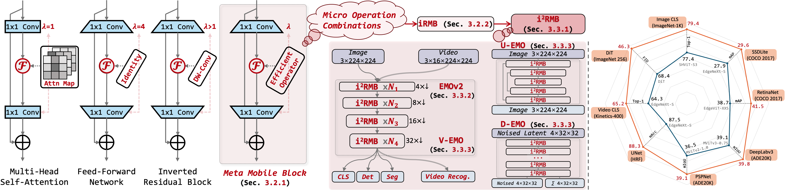

# EMOv2: Pushing 5M Vision Model Frontier

## TODO List
- [ ] Full code will be available in two weeks after internal review approval.

--- 
Official [PyTorch](https://pytorch.org/) implementation of "[EMOv2: Pushing 5M Vision Model Frontier](https://arxiv.org/abs/2412.06674)", which is the extension version of "[Rethinking Mobile Block for Efficient Attention-based Models, ICCV'23](https://openaccess.thecvf.com/content/ICCV2023/papers/Zhang_Rethinking_Mobile_Block_for_Efficient_Attention-based_Models_ICCV_2023_paper.pdf)".

> **Abstract:** This work focuses on developing parameter-efficient and lightweight models for dense predictions while trading off parameters, FLOPs, and performance. Our goal is to set up the new frontier of the 5M magnitude lightweight model on various downstream tasks. Inverted Residual Block (IRB) serves as the infrastructure for lightweight CNNs, but no counterparts have been recognized by attention-based design. Our work rethinks the lightweight infrastructure of efficient IRB and practical components in Transformer from a unified perspective, extending CNN-based IRB to attention-based models and abstracting a one-residual Meta Mobile Block (MMBlock) for lightweight model design. Following neat but effective design criterion, we deduce a modern Improved Inverted Residual Mobile Block (i2RMB) and improve a hierarchical Efficient MOdel (EMOv2) with no elaborate complex structures. Considering the imperceptible latency for mobile users when downloading models under 4G/5G bandwidth and ensuring model performance, we investigate the performance upper limit of lightweight models with a magnitude of 5M. Extensive experiments on various vision recognition, dense prediction, and image generation tasks demonstrate the superiority of our EMOv2 over state-of-the-art methods, e.g., EMOv2-1M/2M/5M achieve 72.3, 75.8, and 79.4 Top-1 that surpass equal-order CNN-/Attention-based models significantly. At the same time, EMOv2-5M equipped RetinaNet achieves 41.5 mAP for object detection tasks that surpasses the previous EMO-5M by +2.6. When employing the more robust training recipe, our EMOv2-5M eventually achieves 82.9 Top-1 accuracy, which elevates the performance of 5M magnitude models to a new level. 

<div align="center">
  
</div>

------
# Main results
## Image Classification on [ImageNet-1K](https://www.image-net.org), †: Using knowledge distillation, *: Using stronger training strategy:
| Model                                                                                                | #Params | FLOPs | Resolution | Top-1 |                        Log                         |
|------------------------------------------------------------------------------------------------------|:-------:|:-----:|:----------:|:-----:|:--------------------------------------------------:|
| [EMOv2-1M](https://github.com/zhangzjn/data/blob/main/emov2_pretrained_weights/EMOv2_1M_224.pth)     |  1.4M   | 285M  | 224 x 224  | 72.3  |  [log](resources/Cls/log_train_EMOv2_1M_224.txt)   |
| [EMOv2-1M†](https://github.com/zhangzjn/data/blob/main/emov2_pretrained_weights/EMOv2_1M_224_KD.pth) |  1.4M   | 285M  | 224 x 224  | 73.5  | [log](resources/Cls/log_train_EMOv2_1M_224_KD.txt) |
| [EMOv2-2M](https://github.com/zhangzjn/data/blob/main/emov2_pretrained_weights/EMOv2_2M_224.pth)     |  2.3M   | 487M  | 224 x 224  | 75.8  |  [log](resources/Cls/log_train_EMOv2_2M_224.txt)   |
| [EMOv2-2M†](https://github.com/zhangzjn/data/blob/main/emov2_pretrained_weights/EMOv2_2M_224_KD.pth) |  2.3M   | 487M  | 224 x 224  | 76.7  | [log](resources/Cls/log_train_EMOv2_2M_224_KD.txt) |
| [EMOv2-5M](https://github.com/zhangzjn/data/blob/main/emov2_pretrained_weights/EMOv2_5M_224.pth)     |  5.1M   | 1035M | 224 x 224  | 79.4  |  [log](resources/Cls/log_train_EMOv2_5M_224.txt)   |
| [EMOv2-5M†](https://github.com/zhangzjn/data/blob/main/emov2_pretrained_weights/EMOv2_5M_224_KD.pth) |  5.1M   | 1035M | 224 x 224  | 80.9  | [log](resources/Cls/log_train_EMOv2_5M_224_KD.txt) |
| [EMOv2-5M*](https://github.com/zhangzjn/data/blob/main/emov2_pretrained_weights/EMOv2_5M_512.pth)    |  5.1M   | 1035M | 224 x 224  | 82.9  |  [log](resources/Cls/log_train_EMOv2_5M_512.txt)   |

## Object Detection Performance on [COCO2017](https://cocodataset.org):
- [SSDLite](https://openaccess.thecvf.com/content_ICCV_2019/papers/Howard_Searching_for_MobileNetV3_ICCV_2019_paper.pdf) 

| Backbone  | #Params |  #Reso  | FLOPs | mAP  | mAP<sub>50</sub> | mAP<sub>75</sub> | mAP<sub>S</sub> | mAP<sub>M</sub> | mAP<sub>L</sub> |                           Log                            |
|:---------:|:-------:|:-------:|:-----:|:----:|:----------------:|:----------------:|:---------------:|:---------------:|:---------------:|:--------------------------------------------------------:|
| EMOv2-1M  |   2.4   | 300×300 | 0.7G  | 22.3 |       37.5       |       22.4       |       2.0       |      21.3       |      43.4G      | [log](resources/Det/SSDLite_1M_300_20240604_021007.log)  |
| EMOv2-1M  |   2.4   | 512×512 | 2.3G  | 26.6 |       44.4       |       27.5       |       7.3       |      31.4       |      43.0G      | [log](resources/Det/SSDLite_1M_512_20240607_225657.log)  |
| EMOv2-2M  |   3.3   | 300×300 | 1.2G  | 26.0 |       43.0       |       26.5       |       3.6       |      26.6       |      50.2G      | [log](resources/Det/SSDLite_2M_300_20240602_113501.log)  |
| EMOv2-2M  |   3.3   | 512×512 | 4.0G  | 30.7 |       49.8       |       31.7       |       9.9       |      37.1       |      47.3G      | [log](resources/Det/SSDLite_2M_512_20240607_231118.log)  |
| EMOv2-5M  |   6.0   | 300×300 | 2.4G  | 29.6 |       47.6       |       30.1       |       5.5       |      32.2       |      54.8G      | [log](resources/Det/SSDLite_5M_300_20240607_152111.log)  |
| EMOv2-5M  |   6.0   | 512×512 | 8.0G  | 34.8 |       54.7       |       36.4       |      13.7       |      42.0       |      52.0G      | [log](resources/Det/SSDLite_5M_512_20240607_231128.log)  |
| EMOv2-20M |  21.2   | 300×300 | 9.1G  | 33.1 |       51.9       |       33.9       |       8.9       |      36.8       |      57.3G      | [log](resources/Det/SSDLite_20M_300_20240607_151706.log) |
| EMOv2-20M |  21.2   | 512×512 | 30.3G | 38.3 |       58.4       |       40.7       |      17.9       |      45.2       |      54.6G      | [log](resources/Det/SSDLite_20M_512_20240607_231311.log) |


- [RetinaNet](https://openaccess.thecvf.com/content_ICCV_2017/papers/Lin_Focal_Loss_for_ICCV_2017_paper.pdf)

| Backbone  | #Params | FLOPs | mAP  | mAP<sub>50</sub> | mAP<sub>75</sub> | mAP<sub>S</sub> | mAP<sub>M</sub> | mAP<sub>L</sub> |                          Log                           |
|:---------:|:-------:|:-----:|:----:|:----------------:|:----------------:|:---------------:|:---------------:|:---------------:|:------------------------------------------------------:|
| EMOv2-1M  |  10.5   | 142G  | 36.9 |       57.1       |       39.0       |      22.1       |      39.8       |      49.5       | [log](resources/Det/RetinaNet_1M_20240601_022554.log)  |
| EMOv2-2M  |  11.5   | 146G  | 39.3 |       60.0       |       41.4       |      23.9       |      43.1       |      51.6       | [log](resources/Det/RetinaNet_2M_20240601_022542.log)  |
| EMOv2-5M  |  14.4   | 158G  | 41.5 |       62.7       |       44.1       |      25.7       |      45.5       |      55.5       | [log](resources/Det/RetinaNet_5M_20240601_113332.log)  |
| EMOv2-20M |  29.8   | 220G  | 43.8 |       65.0       |       47.1       |      28.0       |      47.4       |      59.0       | [log](resources/Det/RetinaNet_20M_20240601_150321.log) |

- [MaskRCNN](https://openaccess.thecvf.com/content_ICCV_2017/papers/Lin_Focal_Loss_for_ICCV_2017_paper.pdf)

| Backbone  | #Params | FLOPs | mAP  | mAP<sub>50</sub> | mAP<sub>75</sub> | mAP<sub>S</sub> | mAP<sub>M</sub> | mAP<sub>L</sub> |                           Log                           |
|:---------:|:-------:|:-----:|:----:|:----------------:|:----------------:|:---------------:|:---------------:|:---------------:|:-------------------------------------------------------:|
| EMOv2-1M  |  21.2   | 165G  | 37.1 |       59.2       |       39.6       |      21.8       |      39.9       |      49.5       |  [log](resources/Det/MaskRCNN_1M_20240601_021019.log)   |
| EMOv2-2M  |  22.1   | 170G  | 39.5 |       61.8       |       42.4       |      22.9       |      43.0       |      52.6       |  [log](resources/Det/MaskRCNN_2M_20240601_021038.log)   |
| EMOv2-5M  |  24.8   | 181G  | 42.3 |       64.3       |       46.3       |      25.8       |      45.6       |      56.3       |  [log](resources/Det/MaskRCNN_5M_20240601_021054.log)   |
| EMOv2-20M |  39.8   | 244G  | 44.2 |       66.2       |       48.7       |      27.4       |      47.6       |      58.7       |  [log](resources/Det/MaskRCNN_20M_20240601_182515.log)  |


## Semantic Segmentation Performance on [ADE20k](http://sceneparsing.csail.mit.edu/):

- [DeepLabv3](https://arxiv.org/pdf/1706.05587.pdf)

| Backbone  | #Params | FLOPs | mIoU | aAcc | mAcc |                          Log                          |
|:---------:|:-------:|:-----:|:----:|:----:|:----:|:-----------------------------------------------------:|
| EMOv2-1M  |   5.6   | 3.3G  | 34.6 | 75.9 | 45.5 | [log](resources/Seg/DeeLabv3_1M_20240601_154452.log)  |
| EMOv2-2M  |   6.6   | 5.0G  | 36.8 | 77.1 | 48.6 | [log](resources/Seg/DeeLabv3_2M_20240601_155117.log)  |
| EMOv2-5M  |   9.9   | 9.1G  | 39.8 | 78.3 | 51.5 | [log](resources/Seg/DeeLabv3_5M_20240601_155125.log)  |
| EMOv2-20M |  26.0   | 31.6G | 43.3 | 79.6 | 56.0 | [log](resources/Seg/DeeLabv3_20M_20240607_231352.log) |

- [FPN](https://openaccess.thecvf.com/content_CVPR_2019/papers/Kirillov_Panoptic_Feature_Pyramid_Networks_CVPR_2019_paper.pdf)

| Backbone  | #Params | FLOPs | mIoU | aAcc | mAcc |                          Log                          |
|:---------:|:-------:|:-----:|:----:|:----:|:----:|:-----------------------------------------------------:|
| EMOv2-1M  |   5.3   | 23.4G | 37.1 | 78.2 | 47.6 |    [log](resources/Seg/FPN_1M_20240607_225438.log)    |
| EMOv2-2M  |   6.2   | 25.1G | 39.9 | 79.3 | 51.1 |    [log](resources/Seg/FPN_2M_20240607_225524.log)    |
| EMOv2-5M  |   8.9   | 29.1G | 42.4 | 80.8 | 53.4 |    [log](resources/Seg/FPN_5M_20240607_231404.log)    |
| EMOv2-20M |  23.9   | 51.5G | 46.8 | 82.2 | 58.3 |   [log](resources/Seg/FPN_20M_20240602_015811.log)    |

- [SegFormer](https://proceedings.neurips.cc/paper/2021/file/64f1f27bf1b4ec22924fd0acb550c235-Paper.pdf)

| Backbone  | #Params | FLOPs | mIoU | aAcc | mAcc |                          Log                           |
|:---------:|:-------:|:-----:|:----:|:----:|:----:|:------------------------------------------------------:|
| EMOv2-1M  |   1.4   | 5.0G  | 37.0 | 77.7 | 47.5 | [log](resources/Seg/SegFormer_1M_20240603_152903.log)  |
| EMOv2-2M  |   2.6   | 10.3G | 40.2 | 79.0 | 51.1 | [log](resources/Seg/SegFormer_2M_20240603_152841.log)  |
| EMOv2-5M  |   5.3   | 14.4G | 43.0 | 80.5 | 53.9 | [log](resources/Seg/SegFormer_5M_20240601_182537.log)  |
| EMOv2-20M |  20.4   | 36.8G | 47.3 | 82.1 | 58.7 | [log](resources/Seg/SegFormer_20M_20240602_015754.log) |

- [PSPNet](https://openaccess.thecvf.com/content_cvpr_2017/papers/Zhao_Pyramid_Scene_Parsing_CVPR_2017_paper.pdf)

| Backbone  | #Params | FLOPs | mIoU | aAcc | mAcc |                          Log                          |
|:---------:|:-------:|:-----:|:----:|:----:|:----:|:-----------------------------------------------------:|
| EMOv2-1M  |   4.2   | 2.9G  | 33.6 | 75.8 | 44.8 |  [log](resources/Seg/PSPNet_1M_20240604_013444.log)   |
| EMOv2-2M  |   5.2   | 4.6G  | 35.7 | 76.7 | 47.0 |  [log](resources/Seg/PSPNet_2M_20240604_013400.log)   |
| EMOv2-5M  |   8.1   | 8.6G  | 39.1 | 78.2 | 51.0 |  [log](resources/Seg/PSPNet_5M_20240602_111634.log)   |
| EMOv2-20M |  23.6   | 30.9G | 43.4 | 79.6 | 55.7 |  [log](resources/Seg/PSPNet_20M_20240602_020206.log)  |

------
# Classification
## Environments
```shell
pip install torch==2.1.2 torchvision==0.16.2 torchaudio==2.1.2 --index-url https://download.pytorch.org/whl/cu118
pip install inplace_abn timm==0.9.16 mmselfsup pandas transformers openpyxl numpy-hilbert-curve pyzorder imgaug numba protobuf==3.20.1 scikit-image faiss-gpu
pip install timm==0.6.5 tensorboardX einops torchprofile fvcore
pip install mmcv==2.1.0 -f https://download.openmmlab.com/mmcv/dist/cu118/torch2.1/index.html

(Opt.) git clone https://github.com/NVIDIA/apex && cd apex && pip3 install -v --disable-pip-version-check --no-cache-dir --global-option="--cpp_ext" --global-option="--cuda_ext" ./ 
(Downstream) pip install terminaltables pycocotools prettytable xtcocotools
(Downstream)pip install mmdet==3.3.0
(Downstream)pip install mmsegmentation==1.2.2
(Downstream)pip install mmaction2==1.2.0
```
  
## Prepare ImageNet-1K Dataset
Download and extract [ImageNet-1K](http://image-net.org/) dataset in the following directory structure:

```
├── imagenet
    ├── train
        ├── n01440764
            ├── n01440764_10026.JPEG
            ├── ...
        ├── ...
    ├── train.txt (optional)
    ├── val
        ├── n01440764
            ├── ILSVRC2012_val_00000293.JPEG
            ├── ...
        ├── ...
    └── val.txt (optional)
```

## Test on ImageNet-1K Dataset
- Download pre-trained [weights](https://github.com/zhangzjn/data/tree/main/emov2_pretrained_weights) to `resources/Cls/`. 
- Test with 8 GPUs in one node:


<details open>
<summary>
EMOv2-1M
</summary>
```python3 -m torch.distributed.launch --nproc_per_node=8 --nnodes=1 --use_env run.py -c configs/emo2/emo2_224.py -m test model.name=EMO2_1M_k5_hybrid model.model_kwargs.checkpoint_path=resources/Cls/EMOv2_1M_224.pth```<br>
==> `Top-1: 72.326`
</details>

<details>
<summary>
EMOv2-1M†
</summary>
```python3 -m torch.distributed.launch --nproc_per_node=8 --nnodes=1 --use_env run.py -c configs/emo2/emo2_224.py -m test model.name=EMO2_1M_k5_hybrid model.model_kwargs.checkpoint_path=resources/Cls/EMOv2_1M_224_KD.pth```<br>
==> `Top-1: 72.326`
</details>


<details>
<summary>
EMOv2-2M
</summary>
```python3 -m torch.distributed.launch --nproc_per_node=8 --nnodes=1 --use_env run.py -c configs/emo2/emo2_224.py -m test model.name=EMO2_2M_k5_hybrid model.model_kwargs.checkpoint_path=resources/Cls/EMOv2_2M_224.pth```<br>
==> `Top-1: 72.326`
</details>

<details>
<summary>
EMOv2-2M†
</summary>
```python3 -m torch.distributed.launch --nproc_per_node=8 --nnodes=1 --use_env run.py -c configs/emo2/emo2_224.py -m test model.name=EMO2_2M_k5_hybrid model.model_kwargs.checkpoint_path=resources/Cls/EMOv2_2M_224_KD.pth```<br>
==> `Top-1: 72.326`
</details>


<details>
<summary>
EMOv2-5M
</summary>
```python3 -m torch.distributed.launch --nproc_per_node=8 --nnodes=1 --use_env run.py -c configs/emo2/emo2_224.py -m test model.name=EMO2_5M_k5_hybrid model.model_kwargs.checkpoint_path=resources/Cls/EMOv2_5M_224.pth```<br>
==> `Top-1: 72.326`
</details>

<details>
<summary>
EMOv2-5M†
</summary>
```python3 -m torch.distributed.launch --nproc_per_node=8 --nnodes=1 --use_env run.py -c configs/emo2/emo2_224.py -m test model.name=EMO2_5M_k5_hybrid model.model_kwargs.checkpoint_path=resources/Cls/EMOv2_5M_224_KD.pth```<br>
==> `Top-1: 72.326`
</details>

<details>
<summary>
EMOv2-5M*
</summary>
```python3 -m torch.distributed.launch --nproc_per_node=8 --nnodes=1 --use_env run.py -c configs/emo2/emo2_512.py -m test model.name=EMO2_5M_k5_hybrid model.model_kwargs.checkpoint_path=resources/Cls/EMOv2_5M_512_KD.pth```<br>
==> `Top-1: 72.326`
</details>


## Train on ImageNet-1K Dataset
- Train with 8 GPUs in one node:
`python3 -m torch.distributed.launch --nproc_per_node=8 --nnodes=1 --use_env run.py -c configs/emo2/emo2_224.py -m train model.name=EMO2_5M_k5_hybrid trainer.checkpoint=runs/emo2`
- Train with 8 GPUs in one node with KD:
`python3 -m torch.distributed.launch --nproc_per_node=8 --nnodes=1 --use_env run.py -c configs/emo2/emo2_224_kd.py -m train model.name=EMO2_5M_k5_hybrid trainer.checkpoint=runs/emo2`
- 

------
# Down-Stream Detection and Segmentation Tasks
## Object Detection
- Refer to [MMDetection](https://github.com/open-mmlab/mmdetection) for the environments.
- Configs can be found in `downstreams/det/configs`
- *E.g.*:<br>
run `.CUDA_VISIBLE_DEVICES=0,1,2,3,4,5,6,7 PORT=29502 ./tools/dist_train.sh configs/ssd/ssdlite_emo2_5M_8gpu_2lr_coco.py 8` for SSDLite with EMO-5M<br>. 

## Semantic Segmentation
- Refer to [MMSegmentation](https://github.com/open-mmlab/mmsegmentation) for the environments.
- Configs can be found in `downstreams/seg/configs`
- *E.g.*:<br>
run `CUDA_VISIBLE_DEVICES=0,1,2,3 PORT=29502 ./tools/dist_train.sh configs/deeplabv3/deeplabv3_emo2_5M-80k_ade20k-512x512.py 4` for DeepLabv3 with EMO-5M<br>


## Citation
If our work is helpful for your research, please consider citing:
```angular2html
@inproceedings{emo2,
  title={Rethinking mobile block for efficient neural models},
  author={Zhang, Jiangning and Li, Xiangtai and Li, Jian and Liu, Liang and Xue, Zhucun and Zhang, Boshen and Jiang, Zhengkai and Huang, Tianxin and Wang, Yabiao and Wang, Chengjie},
  booktitle={ICCV},
  pages={1--8},
  year={2023}
}
```

# Acknowledgements
We thank but not limited to following repositories for providing assistance for our research:
- [TIMM](https://github.com/rwightman/pytorch-image-models)
- [MMDetection](https://github.com/open-mmlab/mmdetection)
- [MMSegmentation](https://github.com/open-mmlab/mmsegmentation)
